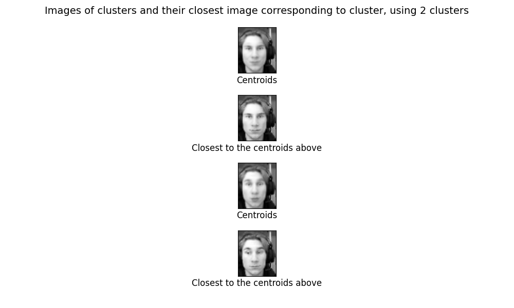
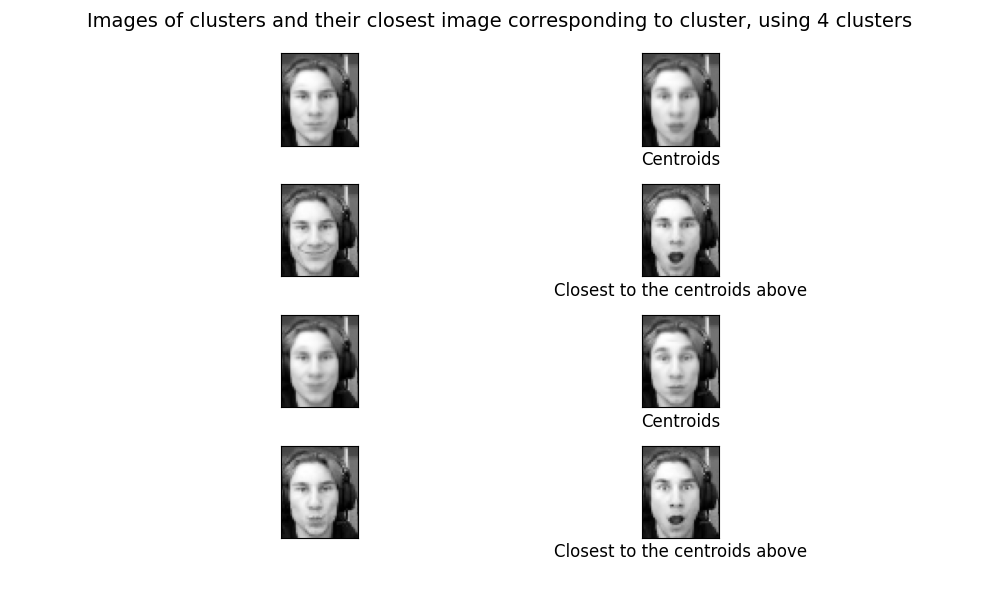
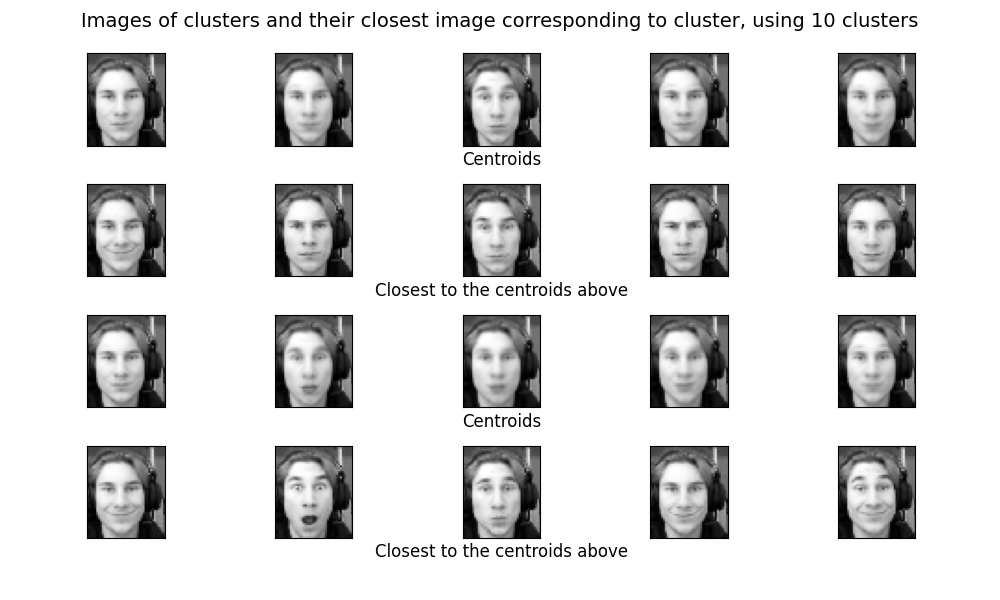

# k-means facial expression clustering.
---
*Author: Christian Salomonsen*

## Description
This is a repo constructed as a part of my project to gather my own training data, and apply the knowledge i got from machine learning.
## Dependencies
- [Numpy](https://numpy.org/install/)
- [Matplotlib](https://pypi.org/project/matplotlib/)
- [PILLOW](https://pillow.readthedocs.io/en/stable/installation.html)
- [os-sys](https://pypi.org/project/os-sys/)
- [opencv-python](https://pypi.org/project/opencv-python/)

## Current results

1. 2 clusters

2. 4 clusters

3. 10 clusters

